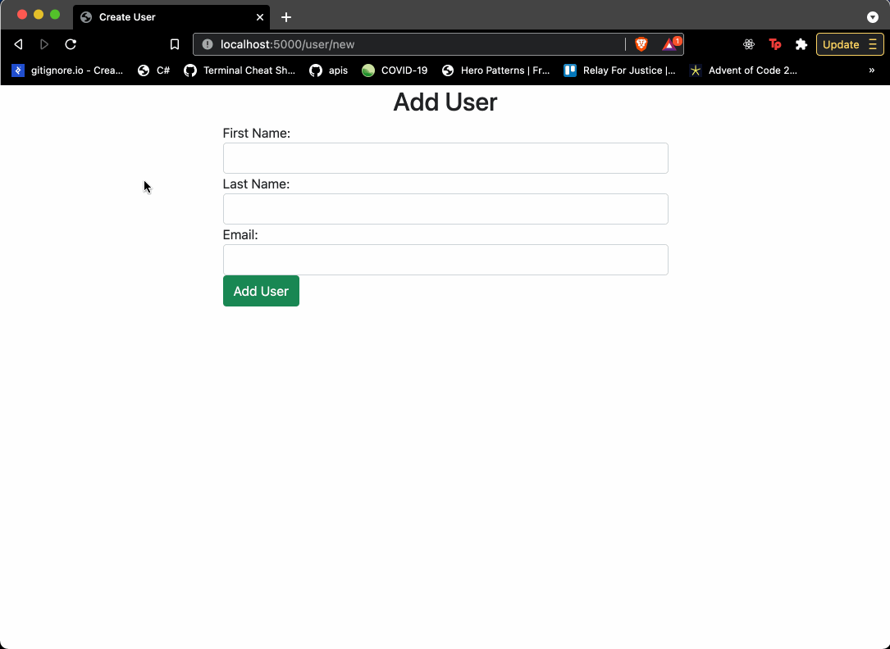

# Users CRUD Modularized

## Coding Dojo Core Assignement 07.10.2022

 

### **Objectives:**
* Students will modularize a Flask app.

 

  

Take the previous assignment and modularize it to use the MVC pattern design.

*Before:*

 

*After:*

 

## **Step:**
* Go through the steps of modularizing the Users CRUD assignment
* Zip up the modularized folder and submit it
